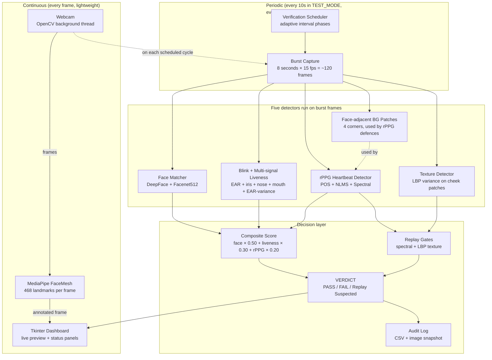
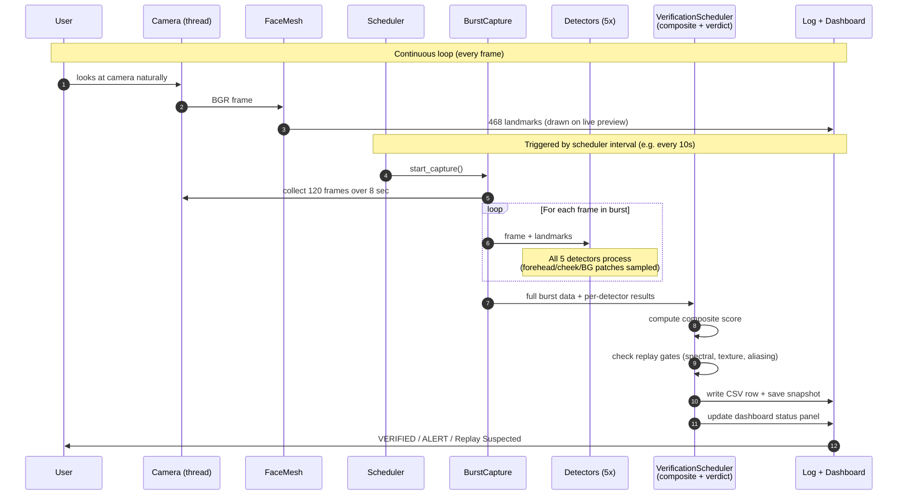
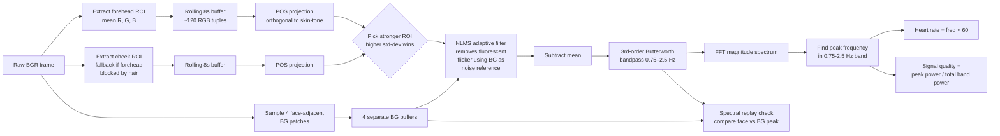
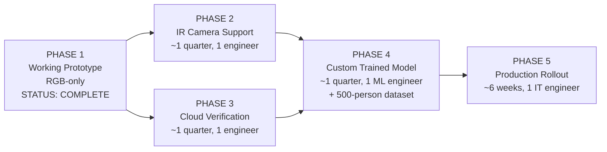

# TruePixel — Knowledge Transfer

> **Read this first.** Onboarding document for new teammates joining the TruePixel project.
> Last updated: 2026-06-04 · Branch: `feature-branch` · Test suite: **63/63 passing**

---

## Table of contents

1. [TL;DR — what is this project?](#1-tldr--what-is-this-project)
2. [The problem we are solving](#2-the-problem-we-are-solving)
3. [High-level architecture](#3-high-level-architecture)
4. [End-to-end verification pipeline](#4-end-to-end-verification-pipeline)
5. [The five detectors — what each one does](#5-the-five-detectors--what-each-one-does)
6. [Composite scoring and the verdict](#6-composite-scoring-and-the-verdict)
7. [rPPG signal processing pipeline (deep dive)](#7-rppg-signal-processing-pipeline-deep-dive)
8. [Replay-attack defences (in depth)](#8-replay-attack-defences-in-depth)
9. [Current implementation status](#9-current-implementation-status)
10. [Empirical results to date](#10-empirical-results-to-date)
11. [Project file structure](#11-project-file-structure)
12. [Getting set up locally](#12-getting-set-up-locally)
13. [Running, testing, and enrolling](#13-running-testing-and-enrolling)
14. [Configuration reference](#14-configuration-reference)
15. [Known limitations and pitfalls](#15-known-limitations-and-pitfalls)
16. [Roadmap — what we need to build next](#16-roadmap--what-we-need-to-build-next)
17. [Glossary](#17-glossary)

---

## 1. TL;DR — what is this project?

**TruePixel** is a silent, software-only desktop application that runs in the background on an enterprise laptop and continuously verifies — every few minutes during a video call — that the person on camera is:

- the **real, enrolled employee** (identity check), AND
- a **live human being right now** (not a recording, photo, or AI deepfake)

It runs on **standard webcam hardware** (no IR depth sensor needed), produces an **auditable log** of every check, and has **no user interaction whatsoever** — employees never see a popup, never have to blink-on-command, never have to do anything.

**Deployment target:** Infosys employee laptops. Pitch goal: a working prototype that demonstrates the architecture to leadership; production rollout follows if approved.

---

## 2. The problem we are solving

Every day, Infosys employees join video calls with clients (Goldman Sachs, JPMorgan, Pfizer, etc.) where confidential information is discussed. **Today, nothing verifies that the person on camera is actually the employee they claim to be.** The risks:

| Attack | How easy | Real-world example |
|---|---|---|
| **Video replay** — phone playing a recorded video of the employee in front of webcam | Trivial (any smartphone) | Hong Kong 2024: deepfake CFO on Zoom call → US$25M wire-transfer fraud |
| **Photo attack** — printed photo or tablet showing employee's face | Trivial | Common in low-stakes proxy fraud |
| **Deepfake** — real-time AI face-swap | Now consumer-grade (DeepFaceLive, Reactor) | WPP CEO deepfake scam 2023 |
| **Interview proxy fraud** — candidate sends a more skilled person to take their interview | Endemic in Indian IT | Industry estimate: 30–50% of remote technical interviews compromised |
| **Substitution under coercion** | — | Rare but high-impact |

**Why nobody has built this yet on standard hardware:** every existing solution (Apple Face ID, Windows Hello) needs IR depth cameras. Continuous software-only verification during a video call is the gap TruePixel fills.

---

## 3. High-level architecture



**Three things to internalize:**

1. **The camera and face mesh run continuously** — every frame, lightweight. That's what powers the live preview in the dashboard.
2. **The five heavy detectors only run during a "burst capture"** — an 8-second window triggered by the scheduler on adaptive intervals (every 10 seconds in test mode, every 2–20 minutes in production).
3. **The verdict is produced once per burst**, not per frame. PASS / FAIL / Replay Suspected. Logged to disk.

---

## 4. End-to-end verification pipeline



**Burst-mode vs continuous mode** is a deliberate architectural choice. rPPG needs ~8 seconds of frames to compute a reliable heart rate via FFT. Blink rate needs at least several seconds to be meaningful. Running these on every frame would burn CPU for no extra information.

The scheduler runs in a separate background thread so the camera and dashboard stay responsive even while a burst is being analyzed.

---

## 5. The five detectors — what each one does

### Detector 1 — Face Matcher (Identity verification)

**File:** [`core/face_matcher.py`](core/face_matcher.py)

**Library/Model:** [DeepFace](https://github.com/serengil/deepface) wrapping **Facenet512** (512-dim face embeddings, pre-trained CNN)

**What it does:** Confirms the live face is the enrolled employee.

**How it works:**
1. At enrollment, captures **6 pose-varied photos** (frontal, left, right, looking up, looking down, smile)
2. Extracts a 512-dim embedding from each → stored in `data/enrolled/<name>/embeddings.npy`
3. At verification time, extracts an embedding from the live frame
4. Computes **cosine similarity** against each enrolled embedding
5. Returns **TOP-K mean** (K = ⌈N/2⌉, minimum 2) — the average of the best half of the matching poses

**Why TOP-K (not full mean, not max):**
- **Full mean** drags scores down because deliberately diverse enrollment poses (some hard, some easy) average out to ~0.43 for genuine users. We empirically observed this and fixed it.
- **Max** is vulnerable to lookalike attacks — a stranger who matches one pose at 1.0 but is orthogonal to others would still score 1.0.
- **TOP-K mean** keeps the score high for genuine users while still requiring resemblance to multiple poses (a stranger matching only one pose scores at most 0.5).

**Output:** `{matched: bool, confidence: float [0..1], name: str}`

**Catches:** wrong-person attacks, identity confusion, look-alikes (somewhat).
**Does NOT catch:** the same person being replayed on video — Facenet sees a recorded face as still matching the identity.

---

### Detector 2 — MediaPipe FaceMesh (Foundation)

**File:** [`core/face_mesh.py`](core/face_mesh.py)

**Library/Model:** [MediaPipe FaceMesh](https://google.github.io/mediapipe/solutions/face_mesh.html) (Google) — pinned to `0.10.9`

**What it does:** Detects 468 facial landmarks per frame. Foundational input for nearly every other detector.

**Why pinned to 0.10.9:**
- Versions above 0.10.21 removed the `mp.solutions.*` namespace
- Pinning ensures consistent landmark indices across deployments
- Module-level assertion (`assert _mp_version <= (0, 10, 21)`) crashes the app at startup if upgrade breaks compatibility

**Catches:** nothing on its own — it's the eyes/ears for everything else.

---

### Detector 3 — Blink + Multi-signal Liveness

**File:** [`core/blink_detector.py`](core/blink_detector.py)

**Algorithm:** Eye Aspect Ratio (EAR) + 5 derived liveness signals

**What it does:** Counts blinks AND tracks micro-movements that prove a face is live, not a static photo.

**EAR formula** (Soukupova & Cech 2016):
```
EAR = (||p2-p6|| + ||p3-p5||) / (2 × ||p1-p4||)
```
6 landmark points per eye. EAR > 0.20 → eye open. EAR < 0.20 → eye closed (blink).

**Five liveness signals tracked per burst:**

| Signal | What it measures | Catches |
|---|---|---|
| **Burst blink count** | Number of confirmed blinks in 8s | Static photo (zero blinks) |
| **EAR variance** | How much EAR fluctuates frame-to-frame | Frozen face image |
| **Iris drift** | Pixel-distance traveled by iris center | Gaze never moves → suspicious |
| **Nose tip drift** | Head micro-movement | Statue-still face → photo |
| **Mouth shape variance** | Width × height changes | No micro-expressions → static |

A static photo gives **zero** on every signal. A live human almost always has at least 2–3 active.

**Output:** `{blink_rate, blink_score, liveness_score [0..1], liveness_signals_active [0..5]}`

---

### Detector 4 — rPPG Heartbeat Detector

**File:** [`core/rppg_detector.py`](core/rppg_detector.py) (the most complex detector)

**Algorithm stack:** POS → NLMS → Butterworth bandpass → FFT → spectral peak

**What it does:** Detects the user's actual heart rate from subtle skin-color changes in the forehead (or cheek) — and uses the signal to defend against replay attacks.

See [Section 7](#7-rppg-signal-processing-pipeline-deep-dive) for the full pipeline diagram.

**Catches:**
- **Static photos / printed images:** no blood flow → no signal
- **Some video replays:** via spectral peak matching against background patches

**Does NOT catch:**
- **High-quality replays on retina-display phones:** the recorded face has the original person's heart rate baked in (it's a real video of a real person)

This is why we layer multiple defences on top.

---

### Detector 5 — Texture Detector (LBP)

**File:** [`core/texture_detector.py`](core/texture_detector.py)

**Algorithm:** Local Binary Patterns (LBP) with P=8 circular neighbors, R=1 radius, uniform pattern method

**Library:** [scikit-image](https://scikit-image.org/) `local_binary_pattern`

**Reference:** Chingovska et al. 2012, IEEE BIOSIG — "On the Effectiveness of Local Binary Patterns in Face Anti-Spoofing"

**What it does:** Independent (non-rPPG) detector that distinguishes **skin texture** from **screen pixels**.

**Why it works:**
- Real skin has high LBP histogram variance — pores, micro-wrinkles, oil sheen, subtle 3D shadows from facial structure
- A printed photo or low-res screen has very low LBP variance — uniform pixel grid, codec-smoothed content
- This signal is **completely independent** of rPPG — different noise sources, different attack surface

**Threshold:** `TEXTURE_LBP_VARIANCE_MIN = 4.70` — below this, screen is suspected.

**Honest limitation today:** Modern retina-display smartphones have pixels small enough that at typical webcam capture resolution, the screen texture is hard to distinguish from skin. We observed empirically that today's iPhone/flagship Android replays give LBP variance 5.95–6.80 — above the threshold. So LBP alone doesn't catch modern phone replays. It DOES catch printed photos and lower-resolution display attacks.

---

## 6. Composite scoring and the verdict

```mermaid
flowchart TD
    Start([Burst complete]) --> CheckAliasing{Ambient<br/>aliasing<br/>detected?<br/>BG has peak in<br/>0.75-2.5 Hz}
    CheckAliasing -- Yes --> Demote[rPPG quality forced to 0<br/>for this burst only]
    CheckAliasing -- No --> RealRppg[Use real rPPG quality]
    Demote --> Spectral
    RealRppg --> Spectral

    Spectral{Spectral replay flag?<br/>BG peak matches face peak<br/>in heart-rate band}
    Spectral -- Fires --> ForceFail[FORCE FAIL<br/>Replay Suspected]
    Spectral -- Clear --> Texture

    Texture{LBP texture suspected?<br/>Cheek variance below 4.7}
    Texture -- Fires --> ForceFail
    Texture -- Clear --> Score

    Score[Compute composite:<br/>face × 0.50 +<br/>liveness × 0.30 +<br/>max&#40;0, rPPG - 0.12&#41; × 0.20]
    Score --> Threshold{composite ≥ 0.70?}
    Threshold -- Yes --> Pass([PASS<br/>VERIFIED])
    Threshold -- No --> Fail([FAIL<br/>composite too low])

    ForceFail --> Log[Write CSV row]
    Pass --> Log
    Fail --> Log
```



**The math, in one block:**

```python
# Step 1: clamp rPPG quality to the noise floor
rppg_contribution = max(0.0, signal_quality - 0.12)  # RPPG_NOISE_FLOOR

# Step 2: weighted sum (weights from config.py)
composite = (
    face_confidence  * 0.50  # FACE_MATCH_WEIGHT
  + liveness_score   * 0.30  # BLINK_WEIGHT (uses multi-signal liveness)
  + rppg_contribution * 0.20  # HEARTBEAT_WEIGHT
)

# Step 3: ambient aliasing override (set rppg_contribution to 0 if BG dominated by aliased peak)
# Step 4: replay gates (force fail if spectral OR texture defences fire)
# Step 5: composite >= 0.70 → PASS; else → FAIL
```

**Why these weights?** They emerged from empirical calibration on real-world office testing:
- `face` is the dominant signal because it's the most discriminating (catches wrong-person directly)
- `liveness` is the second-strongest signal because a photo/static deepfake fails it absolutely
- `rPPG` carries the lowest weight because it's noisy in real-world office lighting (heavily depressed by fluorescent flicker, even with NLMS cleanup)

**The 0.70 threshold** is calibrated so that:
- A real user in normal lighting reliably scores above
- A photo, static deepfake, or weak replay scores below
- A perfect replay attack ends up right at the borderline (which is why we have additional replay gates)

---

## 7. rPPG signal processing pipeline (deep dive)

This is the most complex part of TruePixel. Here's the full pipeline:



### Why each stage exists

| Stage | What it solves |
|---|---|
| **POS projection** (Wang et al. 2017) | Replaces naive `mean(green)` with a chrominance-style projection orthogonal to skin tone. Robust to specular reflection and works on dark skin tones where green-only signal is weak (melanin absorbs green light). |
| **Dual-ROI fallback** | Forehead is preferred but cheek is used if forehead is occluded by hair, cap, or hand. Std-dev of POS signal picks the stronger ROI per burst. |
| **NLMS adaptive filter** | Subtracts ambient flicker noise (fluorescent lights at 50/60 Hz that alias through CMOS rolling shutter into our 0.75–2.5 Hz band) using BG patches as the noise reference. Real pulse survives; common-mode flicker gets cancelled. |
| **Butterworth bandpass** | Restricts signal to the human heart rate band (45–150 BPM). Removes DC drift and high-frequency noise. |
| **FFT peak** | Dominant frequency in passband × 60 = BPM. Peak-to-total-power ratio = signal quality. |
| **Noise floor (0.12)** | Quality below this is treated as artifact, not signal — `effective = max(0, q - 0.12)`. Calibrated so phone screen artifacts (typically 0.05–0.10) contribute zero. |

---

## 8. Replay-attack defences (in depth)

Replay = attacker plays a video of the legitimate employee in front of webcam (phone, tablet, second monitor). This is the **single hardest attack to defeat** because all our signals look real:
- Face match: matches (it IS the real face)
- Blink: blinks happen (recorded blinks play back)
- rPPG: weak but present (screen flicker leaks pulse-frequency artifacts)

We layer **three defence mechanisms** to catch replay:

### Defence 1 — Spectral replay (PPGSecure-inspired)

**Reference:** Nowara et al. IEEE FG 2017 — "PPGSecure: Biometric Presentation Attack Detection Using Photopletysmograms"

**Idea:** A phone screen playing a recorded video pulses at the original person's heart rate. That pulsing leaks into the BG patches around the face. So the face spectrum AND the BG spectrum will both have a peak at the same frequency.

A real face has a heart-rate peak; the room behind it (lit by static ambient light) does NOT. So:
- **Real:** face peak at 1.2 Hz, BG flat → no spectral match → PASS
- **Replay:** face peak at 1.2 Hz, BG also peaks near 1.2 Hz → spectral match → FAIL

**Implementation parameters:**
- `REPLAY_SPECTRAL_FREQ_TOLERANCE_HZ = 0.10` — face and BG peaks must align within ±0.1 Hz
- `REPLAY_SPECTRAL_MIN_POWER_RATIO = 0.20` — BG peak must be ≥ 20% of face peak power to count

### Defence 2 — Ambient-aliasing demotion

**Idea:** When the BG patches themselves are dominated by a heart-rate-band peak (e.g. fluorescent lighting causing aliased flicker), rPPG cannot be trusted at all for this burst. Rather than emit a false positive, **demote the rPPG contribution to zero** for that burst. The composite leans entirely on face + liveness.

**Parameter:** `SIGNAL_DEMOTION_BG_PEAK_RATIO = 0.50` — if BG peak holds ≥ 50% of band energy, demote.

This is what keeps the system functional in fluorescent-lit offices.

### Defence 3 — LBP texture (Detector 5)

Independent of rPPG entirely. See [Detector 5](#detector-5--texture-detector-lbp).

### Legacy Pearson (deprecated, kept for diagnostic)

`compute_face_background_correlation()` still exists in the codebase but the threshold (`REPLAY_ATTACK_CORRELATION_THRESHOLD = 0.99`) is set so high it never fires. Empirical testing showed 40% false positives and 41% false negatives — replaced by spectral peak matching (which still has issues but is better).

---

## 9. Current implementation status

| Component | Status | Test count |
|---|---|---|
| Camera capture | ✅ Production-ready | covered |
| FaceMesh wrapper | ✅ Production-ready, version-pinned | covered |
| Face Matcher (Facenet512 + TOP-K) | ✅ Working | 4 tests |
| Blink + Multi-signal Liveness | ✅ Working | 4 tests |
| rPPG (POS + NLMS) | ✅ Working with caveats | 13 tests |
| Spectral replay defence | ⚠️ Marginal accuracy in lab | 4 tests |
| LBP texture detection | ⚠️ Doesn't catch retina displays | 3 tests |
| Verification Scheduler | ✅ Production-ready | 5 tests |
| Dashboard | ✅ Working | 1 test |
| Audit log (CSV + image) | ✅ Working | covered |

**Total: 63 unit tests, all passing.**

### What's NOT yet built

| Feature | Status | Why important |
|---|---|---|
| **IR camera support** | Not started | Most modern enterprise laptops have IR cameras (Windows Hello). Using them would dramatically strengthen anti-spoofing parity with Face ID. Phase 2. |
| **Cloud verification heartbeats** | Not started | Defends against local-process compromise (admin user disables TruePixel). Phase 3. |
| **Custom trained anti-spoofing model** | Not started | Replaces LBP + spectral with a CNN trained on Infosys-specific data. Major accuracy uplift. Phase 4. |
| **PyInstaller .exe packaging** | Script exists, not run | Needed for IT rollout. |
| **Per-employee calibration** | Not started | Adapts noise floor + thresholds to each user's hardware/lighting. |
| **SIEM integration** | Not started | Pipe audit logs into Infosys's security operations stack. |

---

## 10. Empirical results to date

**Most recent test session (2026-05-31, home lighting on personal laptop, 20 checks total):**

| Category | Count | Verdict | Accuracy |
|---|---|---|---|
| Real legitimate user | 13 | 7 PASS, 6 FAIL | 53.8% true-positive rate |
| Fake (phone replay) | 7 | 0 PASS, 7 FAIL | 100% true-negative rate |
| **Overall** | 20 | — | **70%** |

**Honest caveats:**

1. **The 100% replay block was margin-thin.** Fake composites landed at 0.671–0.696, just below the 0.70 threshold. Neither spectral nor LBP defences fired on any of the 7 replays. The fakes were caught by the general composite gate, not by detection.

2. **A slightly more aggressive replay (brighter phone, better angle) would have passed.** Margin of 0.005–0.030 is fragile.

3. **The 46% false-positive rate on real users is concerning.** Several checks had face_confidence as low as 0.14 — meaning Facenet512 genuinely couldn't see the face well at those moments (heavy backlight, partial occlusion).

4. **Modern phone screens are too fine-pixeled for LBP to catch.** This needs to be documented as a known limitation (the LBP layer is calibrated for printed photos and lower-res displays).

**See [`logs/dev_feedback.csv`](logs/dev_feedback.csv) for the full per-check breakdown.**

---

## 11. Project file structure

```
TruePixel/
├── README.md
├── KNOWLEDGE_TRANSFER.md          ← you are here
├── KNOWLEDGE_TRANSFER.txt         ← earlier plain-text version
├── PROBLEM_STATEMENT.txt          ← pitch document for leadership
├── PROGRESS.md                    ← chronological session log
├── requirements.txt               ← 17 pinned dependencies
├── requirements-dev.txt           ← pytest, pytest-mock
├── config.py                      ← single source of truth for constants
├── main.py                        ← entry point
├── .gitignore                     ← excludes venv, logs, biometric data
│
├── core/                          ← detection + orchestration logic
│   ├── camera.py                  ← threaded OpenCV webcam wrapper
│   ├── face_mesh.py               ← MediaPipe wrapper
│   ├── face_matcher.py            ← Facenet512 + multi-pose + TOP-K
│   ├── blink_detector.py          ← EAR + 5 liveness signals
│   ├── rppg_detector.py           ← POS + NLMS + spectral (the big one)
│   ├── texture_detector.py        ← LBP variance
│   ├── burst_capture.py           ← 8-sec frame collection
│   ├── verification_scheduler.py  ← orchestrates the whole pipeline
│   └── logger_setup.py            ← rotating file logs + UTF-8 console
│
├── ui/
│   ├── dashboard.py               ← Tkinter main window
│   └── components.py              ← reusable widgets (status, log panel, etc.)
│
├── scripts/
│   ├── verify_env.py              ← 9-check environment sanity test
│   ├── validate_rppg.py           ← live rPPG signal graph for tuning
│   ├── analyze_feedback.py        ← processes dev_feedback.csv
│   └── build_exe.py               ← PyInstaller bundler (untested)
│
├── tests/
│   └── test_day1.py               ← 63 unit tests covering every detector
│
├── data/
│   └── enrolled/<name>/           ← enrolled face photos + embeddings
│       ├── photo_1.jpg ... photo_6.jpg
│       ├── embeddings.npy         ← (6, 512) multi-pose matrix
│       └── embedding.npy          ← averaged version (legacy compat)
│
├── logs/                          ← gitignored — privacy
│   ├── truepixel_YYYYMMDD.log     ← rotating runtime log
│   ├── dev_feedback.csv           ← per-check audit data
│   └── feedback_images/           ← snapshot at each check
│
├── backup/                        ← gitignored, for video samples
└── venv/                          ← gitignored, Python 3.11 environment
```

---

## 12. Getting set up locally

### Prerequisites

- **Windows 10/11** (the project is currently Windows-focused; Mac/Linux work but untested for the .exe bundling target)
- **Python 3.11.x** specifically — NOT 3.12+ (mediapipe + tensorflow have no wheels), NOT 3.10 (some wheels missing)
- **Git** for cloning
- A working **webcam**

### Step-by-step

```powershell
# 1. Install Python 3.11.9 if not already installed
winget install -e --id Python.Python.3.11 --silent --accept-source-agreements --accept-package-agreements
# Then close and re-open PowerShell so PATH refreshes

# 2. Verify Python 3.11 is accessible
py -3.11 --version
# Expected: Python 3.11.9

# 3. Clone the repo
cd C:\Users\<your-username>\Documents
git clone https://github.com/Rahul-katigar-1/TruePixel.git
cd TruePixel

# 4. Switch to the working branch
git checkout feature-branch

# 5. Create venv using Python 3.11 specifically
py -3.11 -m venv venv

# 6. Activate venv
.\venv\Scripts\Activate.ps1
# If you hit a script-execution-policy error, run this once:
#   Set-ExecutionPolicy -Scope CurrentUser -ExecutionPolicy RemoteSigned

# 7. Pin pip to a known-stable version
python -m pip install --upgrade pip==24.0

# 8. Install all dependencies (one-shot — DO NOT install piecewise)
pip install -r requirements.txt          # ~10-20 min, ~500 MB downloads
pip install -r requirements-dev.txt      # ~30 sec

# 9. Verify environment
python scripts\verify_env.py
# Expected: Result: 9/9 passed

# 10. Run the test suite
python tests\test_day1.py
# Expected: Results: 63/63 passed

# 11. Enrol your face (one-time)
python -c "from core.face_matcher import FaceMatcher; FaceMatcher().enroll('YourName')"
# Webcam preview opens, 6 photos captured over ~30 seconds
# Saved to data/enrolled/YourName/

# 12. Run the app
python main.py
```

### Common pitfalls

| Problem | Cause | Fix |
|---|---|---|
| `mediapipe` install fails | Python 3.12+ or 3.10- | Use Python 3.11.9 exactly |
| `pip install` resolves wrong versions | Piecewise installs | Always use `pip install -r requirements.txt` (one shot) |
| `cv2.VideoCapture` returns no frames | Another app holding camera | Close Teams/Zoom/OBS |
| Facenet weights download fails | Corporate VPN blocks GitHub | Manually download [facenet512_weights.h5](https://github.com/serengil/deepface_models/releases) → `~/.deepface/weights/` |
| `git push` asks for password | GitHub deprecated password auth (2021) | Use Personal Access Token instead |
| Tkinter not found | Python install without tcl/tk | Reinstall Python 3.11 with all components |

---

## 13. Running, testing, and enrolling

### Run the app

```powershell
python main.py
```

A Tkinter window opens showing:
- **Top-left:** live webcam feed with face mesh overlay
- **Top-right:** status panels (face, blink, heartbeat, log)
- **Bottom:** live rPPG signal graph

A verification check fires every 10 seconds (TEST_MODE). Results appear in the status panel and are logged to `logs/dev_feedback.csv`.

### Run the test suite

```powershell
python tests\test_day1.py
```

### Validate rPPG live

```powershell
python scripts\validate_rppg.py
```

Opens a separate window plotting raw signal, bandpass-filtered signal, and BPM over time. Use this to tune the rPPG pipeline against a reference (e.g. compare to your phone's health app pulse reading).

### Analyze logged feedback

```powershell
python scripts\analyze_feedback.py
```

Reads `logs/dev_feedback.csv` and prints accuracy summaries per ground-truth label.

### Re-enrol a face

```powershell
python -c "from core.face_matcher import FaceMatcher; FaceMatcher().enroll('Rahul')"
```

Replace `'Rahul'` with the person's name. Overwrites prior enrollment for that name.

---

## 14. Configuration reference

Every tunable constant lives in [`config.py`](config.py). The key ones:

```python
# ─── Verification timing ──────────────────────────────────
TEST_MODE                  = True       # 10s interval; set False for production
TEST_MODE_INTERVAL_SECONDS = 10
BURST_DURATION_SECONDS     = 8          # frames captured per burst
BURST_FPS                  = 15

# ─── Face matching ────────────────────────────────────────
FACE_RECOGNITION_MODEL    = "Facenet512"  # 512-dim CNN
FACE_EMBEDDING_DIM        = 512
FACE_MATCH_THRESHOLD      = 0.55         # raw cosine similarity

# ─── Composite scoring weights ────────────────────────────
FACE_MATCH_WEIGHT          = 0.50
BLINK_WEIGHT               = 0.30
HEARTBEAT_WEIGHT           = 0.20
COMPOSITE_ALERT_THRESHOLD  = 0.70

# ─── rPPG ─────────────────────────────────────────────────
RPPG_NOISE_FLOOR           = 0.12        # signal quality below this contributes 0

# ─── Replay defences ──────────────────────────────────────
REPLAY_SPECTRAL_FREQ_TOLERANCE_HZ = 0.10
REPLAY_SPECTRAL_MIN_POWER_RATIO   = 0.20
REPLAY_BG_PATCH_PX                = 40
REPLAY_BG_PATCH_OFFSET_PX         = 20
REPLAY_BG_PATCH_COUNT             = 4

# ─── NLMS adaptive flicker cancellation ───────────────────
NLMS_FILTER_LENGTH         = 4
NLMS_STEP_SIZE             = 0.05
NLMS_REGULARIZATION        = 1.0e-4

# ─── Ambient-aliasing demotion ────────────────────────────
SIGNAL_DEMOTION_BG_PEAK_RATIO = 0.50

# ─── Texture (LBP) ────────────────────────────────────────
TEXTURE_LBP_VARIANCE_MIN   = 4.70        # below this → screen suspected
TEXTURE_PATCH_SIZE_PX      = 64
```

**Do not change weights or thresholds without empirical re-testing.** See `PROGRESS.md` for the history of calibration decisions.

---

## 15. Known limitations and pitfalls

### Limitations of the current prototype

| # | Limitation | Why |
|---|---|---|
| 1 | **Modern retina-display phone replays may pass** | LBP variance on iPhone-class screens (5.9–6.8) overlaps real skin range (5.9–7.0). No clean separation. |
| 2 | **rPPG fragile in fluorescent office lighting** | 50/60 Hz aliasing through rolling shutter pollutes the heart-rate band. NLMS helps but doesn't eliminate. |
| 3 | **Face confidence can drop sharply with backlight** | Window light behind user → underexposed face → Facenet512 cosine drops to 0.14–0.50 range. |
| 4 | **No defence against 3D-printed masks** | Out of scope without IR depth sensor. |
| 5 | **No defence against admin-level local compromise** | An admin can kill the process or modify main.py. Fix is Phase 3 cloud verification. |
| 6 | **Identical twin / convincing sibling not handled** | Face match would pass both; no second factor enrolled. |
| 7 | **First-run network requirement** | DeepFace downloads 95 MB Facenet weights from GitHub on first use. Corporate VPN may block. |

### Pitfalls when working on the code

| Trap | Avoidance |
|---|---|
| Editing config and forgetting to re-run tests | Always run `tests\test_day1.py` after config changes |
| Installing packages piecewise | Use `pip install -r requirements.txt` only |
| Pushing `data/enrolled/` to Git | Already gitignored; double-check `git status` shows nothing biometric |
| Pushing `logs/` to Git | Same as above — face snapshots are PII |
| Upgrading mediapipe | The codebase asserts `mediapipe.__version__ <= 0.10.21`. Newer versions remove the `mp.solutions` namespace and break the code. |
| Upgrading numpy past 1.24.3 | TensorFlow 2.13.1 requires `numpy<=1.24.3`. |

---

## 16. Roadmap — what we need to build next



### Phase 2 — IR camera support

Most modern enterprise laptops (Lenovo ThinkPad X1, Dell Latitude, HP EliteBook with Windows Hello) ship with **IR cameras** for biometric login. We can read them via Windows Media Foundation and add IR-specific liveness signals:
- IR skin-reflectance signature (skin reflects IR differently than screen glass)
- Pseudo-depth from IR flood + dot patterns (similar to Face ID)
- IR signal effectively eliminates phone-screen and printed-photo attacks

**Effort:** ~3 weeks. New file `core/ir_camera.py`, IR-aware logic in scheduler, optional graceful fallback to RGB-only.

### Phase 3 — Cloud verification heartbeats

Defends against **local compromise** — an admin disabling TruePixel, or driver-level camera-feed injection.

**Pattern A (simplest, recommended for v1):** signed verification heartbeats
- Every check, agent sends `{timestamp, employee_id, verdict, composite_score, signature}` to Infosys cloud
- **No biometric data leaves the device** — only metadata
- Cloud detects: missing heartbeats (agent killed), pattern anomalies, signature failures

**Pattern B (optional):** sampled re-verification
- Per N checks, send the 512-dim embedding (not raw frame) to cloud
- Cloud independently runs face match
- If cloud ≠ local verdict, alarm

**Privacy framing:** "TruePixel never sends biometric data — no images, no embeddings unless explicitly opted in — to cloud. Only signed verification heartbeats." DPDP Act 2023 compliant.

**Effort:** ~3 weeks. New `core/cloud_heartbeat.py` + simple Flask/FastAPI receiver + SIEM integration.

### Phase 4 — Custom-trained anti-spoofing model

Replaces LBP + spectral with a CNN trained specifically on:
- Diverse Indian skin-tone distribution (Fitzpatrick I–VI)
- Real-world office and home-office lighting captures
- Genuine vs spoof samples (photo, screen, mask, deepfake)

**Reference architectures:**
- MiniFASNetV2 (Silent-Face-Anti-Spoofing, Apache 2.0 license, commercial-safe)
- Central Difference Convolutional Network (CDCN, CVPR 2020)

**Dataset effort:** 500–2000 Infosys employee captures + consent + DPDP compliance.

**Engineering effort:** ~3 months end-to-end (1 ML engineer + data engineer).

### Phase 5 — Production rollout

- PyInstaller `.exe` bundling (~25 MB total with quantized weights)
- IT-managed silent install on employee laptops
- SIEM integration with Infosys's security operations
- Per-employee onboarding flow

**Effort:** ~6 weeks.

---

## 17. Glossary

| Term | Definition |
|---|---|
| **rPPG** | remote PhotoPlethysmoGraphy. Detecting heart rate from subtle skin color changes in webcam video. |
| **EAR** | Eye Aspect Ratio. Ratio of vertical to horizontal eye landmark distances. Drops sharply during a blink. |
| **POS** | Plane Orthogonal to Skin. An rPPG signal projection that cancels common-mode illumination noise. |
| **NLMS** | Normalized Least-Mean-Squares. Adaptive filter that uses a reference signal to subtract noise from a primary signal. Used here to remove fluorescent flicker. |
| **PPGSecure** | Anti-spoofing approach (Nowara 2017) that compares rPPG signal in face vs background regions. |
| **LBP** | Local Binary Pattern. Texture descriptor that captures local pixel-level variation. Real skin has high variance; screens have low variance. |
| **Burst capture** | The 8-second window during which all heavy detectors run. Frames are buffered, then analyzed once. |
| **Composite score** | The weighted sum of face, liveness, and rPPG signals. The single number that drives PASS/FAIL. |
| **Noise floor** | Minimum rPPG signal quality below which the contribution is clamped to zero. Designed to reject phone-screen artifacts. |
| **Spectral replay** | A replay attack detected by face FFT peak matching the BG FFT peak in the heart-rate band. |
| **Ambient aliasing** | When fluorescent flicker dominates the BG signal's heart-rate band, causing the rPPG to be unreliable. We demote rPPG to 0 in that case. |
| **Multi-pose enrollment** | Capturing the user in 6 deliberately varied poses at enrollment time, storing each embedding separately. Increases robustness to real-world variation at match time. |
| **TOP-K mean** | Aggregation across multiple enrolled poses: take the mean of the top K matching poses (K = ⌈N/2⌉). Rejects single-pose lookalike attacks while accepting genuine users whose live frame matches some enrollment poses better than others. |
| **TEST_MODE** | A config flag — when True, verification fires every 10 seconds for development/demo. When False, uses an adaptive 2/5/10/15–20 minute production schedule. |
| **Composite alert threshold** | The score (0.70) above which a check is considered VERIFIED. Below → FAIL. |
| **Facenet512** | A 512-dimensional face embedding model from DeepFace. Replaces older Facenet (128-dim) for better discrimination. |
| **MediaPipe FaceMesh** | Google's facial landmark detector — 468 points per face, runs in real time on CPU. |

---

## Where to go from here

- **If you're new and want to understand the code:** read [`core/verification_scheduler.py`](core/verification_scheduler.py) first — it's the orchestrator and gives you the full picture of how detectors are wired together.
- **If you want to tune signal processing:** start with [`core/rppg_detector.py`](core/rppg_detector.py) and use `scripts/validate_rppg.py` for live tuning.
- **If you want to improve replay defence:** the LBP threshold and spectral parameters are the immediate levers. The long-term answer is Phase 4 (custom-trained CNN).
- **If you want to understand the empirical state:** read [`PROGRESS.md`](PROGRESS.md) chronologically and look at [`logs/dev_feedback.csv`](logs/dev_feedback.csv).
- **If you want the pitch / business framing:** read [`PROBLEM_STATEMENT.txt`](PROBLEM_STATEMENT.txt).

**Welcome to the project. Questions? Ask in the team channel — and propose updates to this document as you find gaps.**
